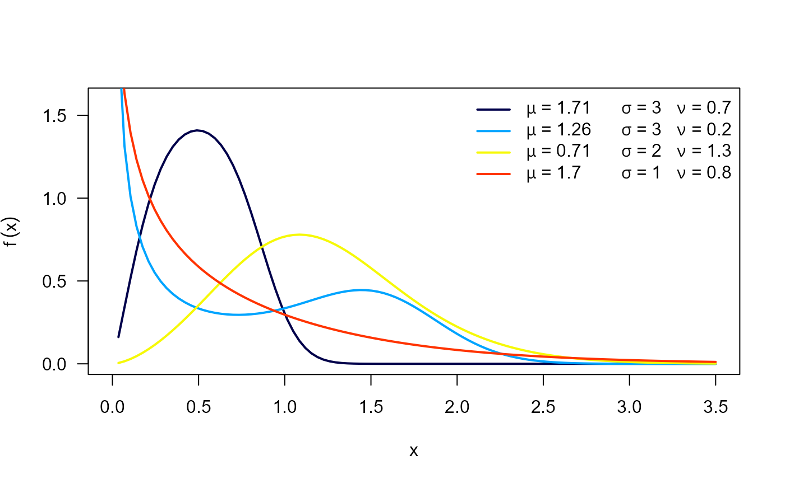
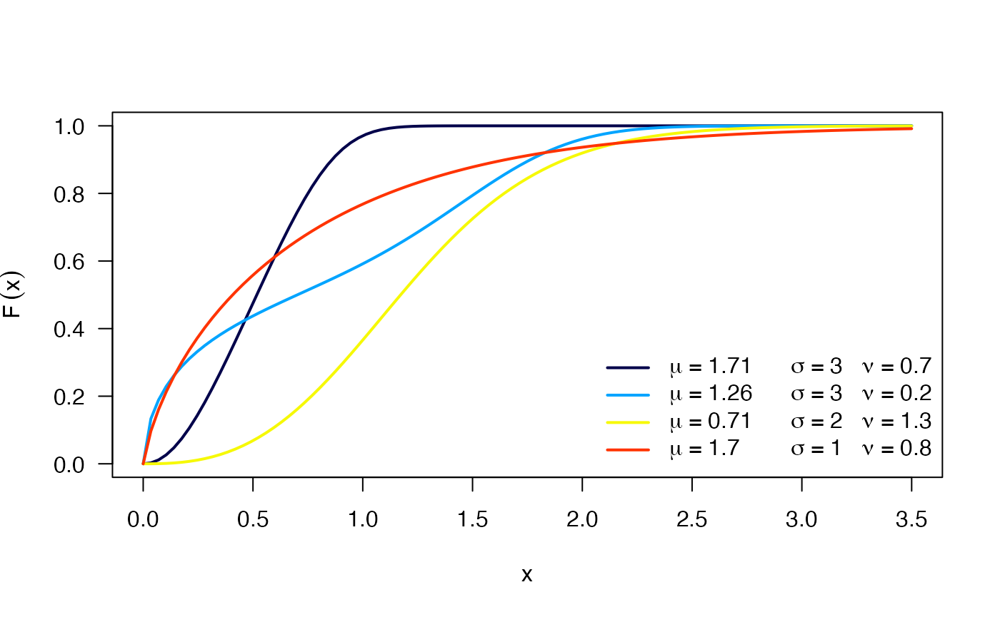
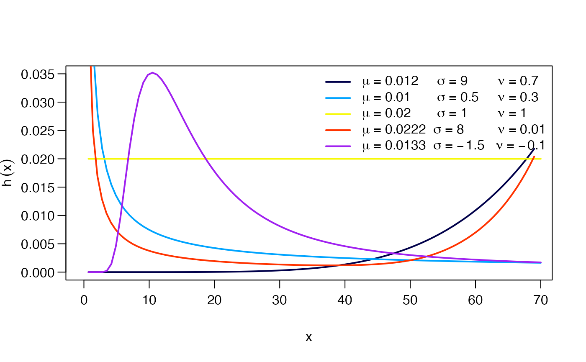
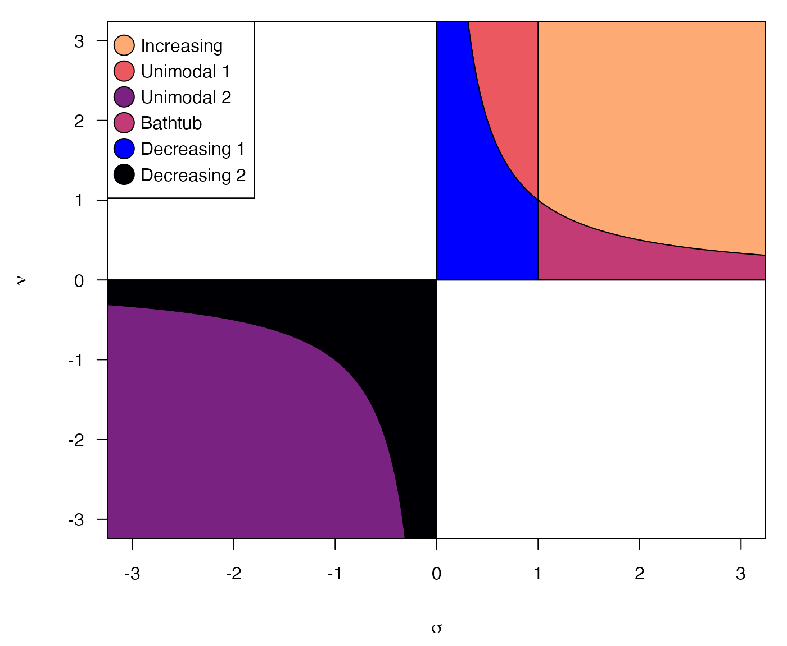
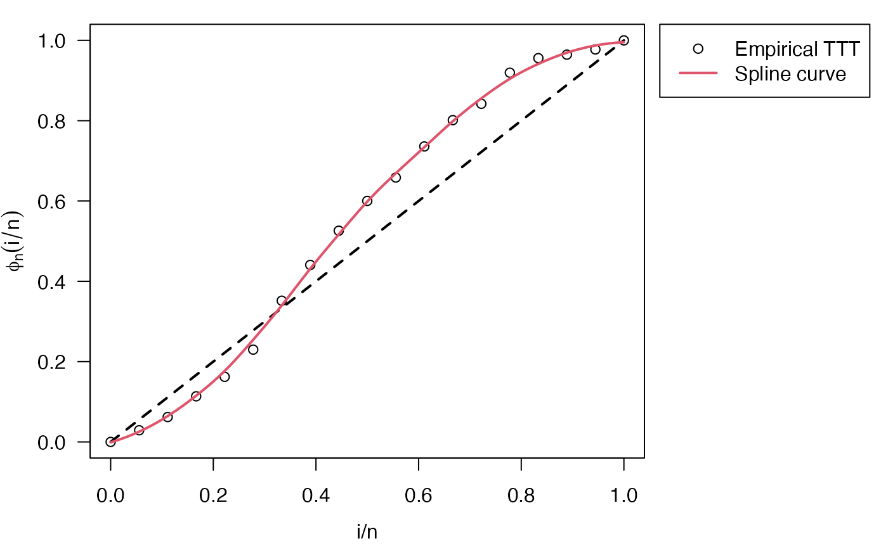
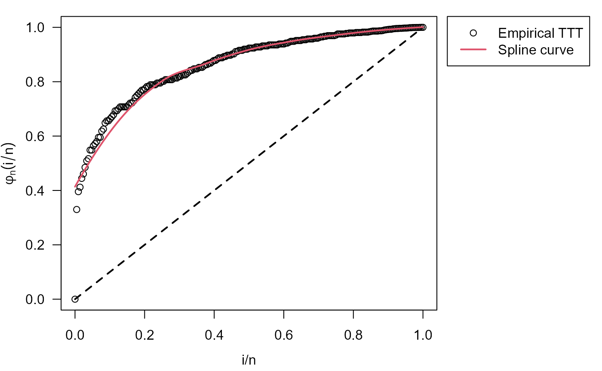

# OW distribution

``` r

library(RelDists)
#> Loading required package: survival
#> Loading required package: EstimationTools
#> 
#> ><<<<<<<<<<<<<<<<<<<<<<<<   EstimationTools Version 4.3.1   >>>>>>>>>>>>>>>>>>>>>>>><
#>   Feel free to report bugs in https://github.com/Jaimemosg/EstimationTools/issues
library(EstimationTools)
library(gamlss)
#> Loading required package: splines
#> Loading required package: gamlss.data
#> 
#> Attaching package: 'gamlss.data'
#> The following object is masked from 'package:datasets':
#> 
#>     sleep
#> Loading required package: gamlss.dist
#> Loading required package: nlme
#> Loading required package: parallel
#>  **********   GAMLSS Version 5.5-0  **********
#> For more on GAMLSS look at https://www.gamlss.com/
#> Type gamlssNews() to see new features/changes/bug fixes.
```

## Odd Weibull distribution

This distribution was proposed by Cooray (2006). The probability density
function \\f(x)\\ and cumulative density function \\F(x)\\ are given by:

\\f(x) = \left( \frac{\sigma\nu}{x} \right) (\mu x)^\sigma e^{(\mu
x)^\sigma} \left(e^{(\mu x)^{\sigma}}-1\right)^{\nu-1} \left\[ 1 +
\left(e^{(\mu x)^{\sigma}}-1\right)^\nu \right\]^{-2},\\

and

\\F(x) = 1 - \left\[ 1 + \left( e^{(\mu x)^{\sigma}} - 1 \right)^\nu
\right\]^{-1}, \quad x\>0,\\

respectively, where \\\mu\>0, \quad \sigma\nu\>0\\. \\\mu\\ is the scale
parameter, \\\sigma\\ and \\\nu\\ are the shape parameters. Next figure
shows possible shapes of the \\f(x)\\ and \\F(x)\\ for several values of
the parameters.



The hazard function (hf) of the OW distribution is:

\\h(x) = \left( \frac{\sigma\nu}{x} \right) (\mu x)^\sigma e^{(\mu
x)^\sigma} \left(e^{(\mu x)^{\sigma}}-1\right)^{\nu-1} \left\[ 1 +
\left(e^{(\mu x)^{\sigma}}-1\right)^\nu \right\]^{-1}, x\>0,\\

where the hf can take the following shapes:

- Increasing if \\\sigma\>1\\ and \\\sigma\nu\>1\\.

- Decreasing if \\\sigma\<1\\ and \\\sigma\nu\<1\\.

- Unimodal shaped if either \\\sigma\<0\\ and \\\nu\<0\\ or
  \\\sigma\<1\\ and \\\sigma\nu\geq 1\\.

- Bathtub shaped if \\\sigma\>1\\ and \\\sigma\nu\geq 1\\.

The figure shows possible shapes of the hf mentioned above:



The following figure illustrate the regions corresponding to the
different hazard shapes:



## Application examples

### Time to failure on electronic equipment

Cooray (2015) used the following data provided by Wang (2000) in order
to fit an OW distribution through maximum likelihood estimation (MLE):

5, 11, 21, 31, 46, 75, 98, 122, 145, 165, 195, 224, 245, 293, 321, 330,
350, 420.

The data above is the time to failure of an electronic device in hours.
As an alternative to classical MLE, We used the function to fit an
only-intercept model in order to estimate parameters of OW distribution
without covariates. Using our
[`initValuesOW()`](http://fhernanb.github.io/RelDists/reference/initValuesOW.md),
we can obtain an initial guess and the valid region.

``` r

data("equipment")
my_initial_guess <- initValuesOW(formula = equipment ~ 1)

summary(my_initial_guess)
#> --------------------------------------------------------------------
#> Initial Values
#> sigma = 5
#> nu = 0.1
#> --------------------------------------------------------------------
#> Search Regions
#> For sigma: all(sigma > 1)
#> For nu: all(nu < 1/sigma)
#> --------------------------------------------------------------------
#> Hazard shape: Bathtub
```

[`initValuesOW()`](http://fhernanb.github.io/RelDists/reference/initValuesOW.md)
function detected the Bathtub hazard shape, which corresponds to a
convex-then-concave shape of total time on test (TTT) plot

``` r

old_par <- par(mfrow = c(1, 1)) # save previous graphical parameters

par(mar = c(3.7, 3.7, 1, 10), mgp = c(2.5, 1, 0))
plot(my_initial_guess, las = 1)
legend.HazardShape(x = 1.07, y = 1.04, xpd = TRUE)
```



``` r


par(old_par) # restore previous graphical parameters
```

Therefore, we define the search region according to
[`initValuesOW()`](http://fhernanb.github.io/RelDists/reference/initValuesOW.md)
outputs

``` r

# Custom search region
myvalues <- list(sigma = "all(sigma > 1)",
                 nu = "all(nu < 1/sigma)")
```

and we perform the fit using
[`gamlss()`](https://rdrr.io/pkg/gamlss/man/gamlss.html)

``` r

# gamlss set up
con.out <-gamlss.control(n.cyc = 300, trace=TRUE)
myOW <- myOW_region(family = OW(sigma.link='identity'),
                    valid.values = myvalues, initVal = my_initial_guess)

param_ee <- gamlss(equipment ~ 1, sigma.fo = ~ 1, nu.fo = ~ 1, 
                   sigma.start = 5, nu.start = 0.1,
                   control = con.out, family = myOW)
#> GAMLSS-RS iteration 1: Global Deviance = 220.3699 
#> GAMLSS-RS iteration 2: Global Deviance = 218.2162 
#> GAMLSS-RS iteration 3: Global Deviance = 217.5282 
#> GAMLSS-RS iteration 4: Global Deviance = 217.3291 
#> GAMLSS-RS iteration 5: Global Deviance = 217.2142 
#> GAMLSS-RS iteration 6: Global Deviance = 217.1047 
#> GAMLSS-RS iteration 7: Global Deviance = 216.9932 
#> GAMLSS-RS iteration 8: Global Deviance = 216.8872 
#> GAMLSS-RS iteration 9: Global Deviance = 216.7914 
#> GAMLSS-RS iteration 10: Global Deviance = 216.707 
#> GAMLSS-RS iteration 11: Global Deviance = 216.6337 
#> GAMLSS-RS iteration 12: Global Deviance = 216.5706 
#> GAMLSS-RS iteration 13: Global Deviance = 216.5168 
#> GAMLSS-RS iteration 14: Global Deviance = 216.471 
#> GAMLSS-RS iteration 15: Global Deviance = 216.4324 
#> GAMLSS-RS iteration 16: Global Deviance = 216.3997 
#> GAMLSS-RS iteration 17: Global Deviance = 216.3723 
#> GAMLSS-RS iteration 18: Global Deviance = 216.3492 
#> GAMLSS-RS iteration 19: Global Deviance = 216.3299 
#> GAMLSS-RS iteration 20: Global Deviance = 216.3136 
#> GAMLSS-RS iteration 21: Global Deviance = 216.3 
#> GAMLSS-RS iteration 22: Global Deviance = 216.2885 
#> GAMLSS-RS iteration 23: Global Deviance = 216.2789 
#> GAMLSS-RS iteration 24: Global Deviance = 216.2708 
#> GAMLSS-RS iteration 25: Global Deviance = 216.264 
#> GAMLSS-RS iteration 26: Global Deviance = 216.2583 
#> GAMLSS-RS iteration 27: Global Deviance = 216.2533 
#> GAMLSS-RS iteration 28: Global Deviance = 216.2488 
#> GAMLSS-RS iteration 29: Global Deviance = 216.245 
#> GAMLSS-RS iteration 30: Global Deviance = 216.2418 
#> GAMLSS-RS iteration 31: Global Deviance = 216.2391 
#> GAMLSS-RS iteration 32: Global Deviance = 216.2369 
#> GAMLSS-RS iteration 33: Global Deviance = 216.2351 
#> GAMLSS-RS iteration 34: Global Deviance = 216.2336 
#> GAMLSS-RS iteration 35: Global Deviance = 216.232 
#> GAMLSS-RS iteration 36: Global Deviance = 216.2306 
#> GAMLSS-RS iteration 37: Global Deviance = 216.2294 
#> GAMLSS-RS iteration 38: Global Deviance = 216.2284
summary(param_ee)
#> ******************************************************************
#> Family:  c("OW", "Odd Weibull") 
#> 
#> Call:  gamlss(formula = equipment ~ 1, sigma.formula = ~1,  
#>     nu.formula = ~1, family = myOW, sigma.start = 5,  
#>     nu.start = 0.1, control = con.out) 
#> 
#> Fitting method: RS() 
#> 
#> ------------------------------------------------------------------
#> Mu link function:  log
#> Mu Coefficients:
#>             Estimate Std. Error t value Pr(>|t|)    
#> (Intercept)   -5.240      0.205  -25.56 8.79e-14 ***
#> ---
#> Signif. codes:  0 '***' 0.001 '**' 0.01 '*' 0.05 '.' 0.1 ' ' 1
#> 
#> ------------------------------------------------------------------
#> Sigma link function:  identity
#> Sigma Coefficients:
#>             Estimate Std. Error t value Pr(>|t|)  
#> (Intercept)    3.283      1.423   2.307   0.0357 *
#> ---
#> Signif. codes:  0 '***' 0.001 '**' 0.01 '*' 0.05 '.' 0.1 ' ' 1
#> 
#> ------------------------------------------------------------------
#> Nu link function:  log 
#> Nu Coefficients:
#>             Estimate Std. Error t value Pr(>|t|)  
#> (Intercept)  -1.2715     0.5019  -2.534   0.0229 *
#> ---
#> Signif. codes:  0 '***' 0.001 '**' 0.01 '*' 0.05 '.' 0.1 ' ' 1
#> 
#> ------------------------------------------------------------------
#> No. of observations in the fit:  18 
#> Degrees of Freedom for the fit:  3
#>       Residual Deg. of Freedom:  15 
#>                       at cycle:  38 
#>  
#> Global Deviance:     216.2284 
#>             AIC:     222.2284 
#>             SBC:     224.8996 
#> ******************************************************************
```

In the following table we summarize the results and compare them with
those gotten by Cooray (2015)

| Parameter  | MLE (Cooray 2015) |  GAMLSS  |
|:----------:|:-----------------:|:--------:|
|  \\\mu\\   |     5.35e-03      | 5.30e-03 |
| \\\sigma\\ |      3.22388      |  3.2828  |
|  \\\nu\\   |      0.28424      |  0.2804  |

### Mortality in mice exposed to radiation

Cooray (2006) used a dataset with 208 data points provided by Kimball
(1960) with the ages at death in weeks for male mice exposed to 240r of
gamma radiation. Again, we implement a workflow for parameter estimation
with `myOW_region` and `gamlss` functions.

``` r

# Do not forget to load 'RelDists' package
data("mice")
init_vals <- initValuesOW(formula = mice ~ 1)

summary(init_vals)
#> --------------------------------------------------------------------
#> Initial Values
#> sigma = 2
#> nu = 6
#> --------------------------------------------------------------------
#> Search Regions
#> For sigma: all(sigma > 1)
#> For nu: all(nu > 1/sigma)
#> --------------------------------------------------------------------
#> Hazard shape: Increasing
```

With
[`initValuesOW()`](http://fhernanb.github.io/RelDists/reference/initValuesOW.md)
function we identified an increasing hazard shape, as well as was stated
by Cooray (2006), because TTT plot is concave.

``` r

old_par <- par(mfrow = c(1, 1)) # save previous graphical parameters

par(mar = c(3.7, 3.7, 1, 10), mgp = c(2.5, 1, 0))
plot(init_vals, las = 1)
legend.HazardShape(x = 1.07, y = 1.04, xpd = TRUE)
```



``` r


par(old_par) # restore previous graphical parameters
```

Hence, we implement the estimation procedure

``` r

# gamlss set up
myOW <- myOW_region(initVal = init_vals)

# Custom search region
# Do not forget to load 'gamlss' library
param_mm <- gamlss(mice ~ 1, sigma.fo = ~ 1, nu.fo = ~ 1,
                   sigma.start = 2, nu.start = 6,
                   control = con.out,
                   family = myOW)
#> GAMLSS-RS iteration 1: Global Deviance = 2031.511 
#> GAMLSS-RS iteration 2: Global Deviance = 2006.257 
#> GAMLSS-RS iteration 3: Global Deviance = 2005.168 
#> GAMLSS-RS iteration 4: Global Deviance = 2005.063 
#> GAMLSS-RS iteration 5: Global Deviance = 2004.941 
#> GAMLSS-RS iteration 6: Global Deviance = 2004.817 
#> GAMLSS-RS iteration 7: Global Deviance = 2004.69 
#> GAMLSS-RS iteration 8: Global Deviance = 2004.558 
#> GAMLSS-RS iteration 9: Global Deviance = 2004.423 
#> GAMLSS-RS iteration 10: Global Deviance = 2004.283 
#> GAMLSS-RS iteration 11: Global Deviance = 2004.14 
#> GAMLSS-RS iteration 12: Global Deviance = 2003.991 
#> GAMLSS-RS iteration 13: Global Deviance = 2003.838 
#> GAMLSS-RS iteration 14: Global Deviance = 2003.68 
#> GAMLSS-RS iteration 15: Global Deviance = 2003.517 
#> GAMLSS-RS iteration 16: Global Deviance = 2003.348 
#> GAMLSS-RS iteration 17: Global Deviance = 2003.174 
#> GAMLSS-RS iteration 18: Global Deviance = 2002.993 
#> GAMLSS-RS iteration 19: Global Deviance = 2002.807 
#> GAMLSS-RS iteration 20: Global Deviance = 2002.613 
#> GAMLSS-RS iteration 21: Global Deviance = 2002.413 
#> GAMLSS-RS iteration 22: Global Deviance = 2002.205 
#> GAMLSS-RS iteration 23: Global Deviance = 2001.99 
#> GAMLSS-RS iteration 24: Global Deviance = 2001.766 
#> GAMLSS-RS iteration 25: Global Deviance = 2001.533 
#> GAMLSS-RS iteration 26: Global Deviance = 2001.292 
#> GAMLSS-RS iteration 27: Global Deviance = 2001.041 
#> GAMLSS-RS iteration 28: Global Deviance = 2000.78 
#> GAMLSS-RS iteration 29: Global Deviance = 2000.507 
#> GAMLSS-RS iteration 30: Global Deviance = 2000.224 
#> GAMLSS-RS iteration 31: Global Deviance = 1999.929 
#> GAMLSS-RS iteration 32: Global Deviance = 1999.621 
#> GAMLSS-RS iteration 33: Global Deviance = 1999.299 
#> GAMLSS-RS iteration 34: Global Deviance = 1998.964 
#> GAMLSS-RS iteration 35: Global Deviance = 1998.613 
#> GAMLSS-RS iteration 36: Global Deviance = 1998.247 
#> GAMLSS-RS iteration 37: Global Deviance = 1997.864 
#> GAMLSS-RS iteration 38: Global Deviance = 1997.463 
#> GAMLSS-RS iteration 39: Global Deviance = 1997.037 
#> GAMLSS-RS iteration 40: Global Deviance = 1996.591 
#> GAMLSS-RS iteration 41: Global Deviance = 1996.124 
#> GAMLSS-RS iteration 42: Global Deviance = 1995.634 
#> GAMLSS-RS iteration 43: Global Deviance = 1995.121 
#> GAMLSS-RS iteration 44: Global Deviance = 1994.584 
#> GAMLSS-RS iteration 45: Global Deviance = 1994.022 
#> GAMLSS-RS iteration 46: Global Deviance = 1993.434 
#> GAMLSS-RS iteration 47: Global Deviance = 1992.822 
#> GAMLSS-RS iteration 48: Global Deviance = 1992.183 
#> GAMLSS-RS iteration 49: Global Deviance = 1991.518 
#> GAMLSS-RS iteration 50: Global Deviance = 1990.826 
#> GAMLSS-RS iteration 51: Global Deviance = 1990.111 
#> GAMLSS-RS iteration 52: Global Deviance = 1989.373 
#> GAMLSS-RS iteration 53: Global Deviance = 1988.617 
#> GAMLSS-RS iteration 54: Global Deviance = 1987.847 
#> GAMLSS-RS iteration 55: Global Deviance = 1987.068 
#> GAMLSS-RS iteration 56: Global Deviance = 1986.285 
#> GAMLSS-RS iteration 57: Global Deviance = 1985.506 
#> GAMLSS-RS iteration 58: Global Deviance = 1984.74 
#> GAMLSS-RS iteration 59: Global Deviance = 1983.994 
#> GAMLSS-RS iteration 60: Global Deviance = 1983.277 
#> GAMLSS-RS iteration 61: Global Deviance = 1982.597 
#> GAMLSS-RS iteration 62: Global Deviance = 1981.963 
#> GAMLSS-RS iteration 63: Global Deviance = 1981.381 
#> GAMLSS-RS iteration 64: Global Deviance = 1980.854 
#> GAMLSS-RS iteration 65: Global Deviance = 1980.384 
#> GAMLSS-RS iteration 66: Global Deviance = 1979.972 
#> GAMLSS-RS iteration 67: Global Deviance = 1979.619 
#> GAMLSS-RS iteration 68: Global Deviance = 1979.317 
#> GAMLSS-RS iteration 69: Global Deviance = 1979.062 
#> GAMLSS-RS iteration 70: Global Deviance = 1978.85 
#> GAMLSS-RS iteration 71: Global Deviance = 1978.676 
#> GAMLSS-RS iteration 72: Global Deviance = 1978.533 
#> GAMLSS-RS iteration 73: Global Deviance = 1978.417 
#> GAMLSS-RS iteration 74: Global Deviance = 1978.324 
#> GAMLSS-RS iteration 75: Global Deviance = 1978.25 
#> GAMLSS-RS iteration 76: Global Deviance = 1978.192 
#> GAMLSS-RS iteration 77: Global Deviance = 1978.146 
#> GAMLSS-RS iteration 78: Global Deviance = 1978.112 
#> GAMLSS-RS iteration 79: Global Deviance = 1978.085 
#> GAMLSS-RS iteration 80: Global Deviance = 1978.064 
#> GAMLSS-RS iteration 81: Global Deviance = 1978.047 
#> GAMLSS-RS iteration 82: Global Deviance = 1978.034 
#> GAMLSS-RS iteration 83: Global Deviance = 1978.024 
#> GAMLSS-RS iteration 84: Global Deviance = 1978.016 
#> GAMLSS-RS iteration 85: Global Deviance = 1978.01 
#> GAMLSS-RS iteration 86: Global Deviance = 1978.005 
#> GAMLSS-RS iteration 87: Global Deviance = 1978.001 
#> GAMLSS-RS iteration 88: Global Deviance = 1977.998 
#> GAMLSS-RS iteration 89: Global Deviance = 1977.996 
#> GAMLSS-RS iteration 90: Global Deviance = 1977.994 
#> GAMLSS-RS iteration 91: Global Deviance = 1977.992 
#> GAMLSS-RS iteration 92: Global Deviance = 1977.991 
#> GAMLSS-RS iteration 93: Global Deviance = 1977.99
summary(param_mm)
#> ******************************************************************
#> Family:  c("OW", "Odd Weibull") 
#> 
#> Call:  gamlss(formula = mice ~ 1, sigma.formula = ~1, nu.formula = ~1,  
#>     family = myOW, sigma.start = 2, nu.start = 6, control = con.out) 
#> 
#> Fitting method: RS() 
#> 
#> ------------------------------------------------------------------
#> Mu link function:  log
#> Mu Coefficients:
#>             Estimate Std. Error t value Pr(>|t|)    
#> (Intercept) -4.87857    0.01489  -327.6   <2e-16 ***
#> ---
#> Signif. codes:  0 '***' 0.001 '**' 0.01 '*' 0.05 '.' 0.1 ' ' 1
#> 
#> ------------------------------------------------------------------
#> Sigma link function:  log
#> Sigma Coefficients:
#>             Estimate Std. Error t value Pr(>|t|)    
#> (Intercept)   1.8206     0.1349    13.5   <2e-16 ***
#> ---
#> Signif. codes:  0 '***' 0.001 '**' 0.01 '*' 0.05 '.' 0.1 ' ' 1
#> 
#> ------------------------------------------------------------------
#> Nu link function:  log 
#> Nu Coefficients:
#>             Estimate Std. Error t value Pr(>|t|)  
#> (Intercept)  -0.2794     0.1640  -1.704     0.09 .
#> ---
#> Signif. codes:  0 '***' 0.001 '**' 0.01 '*' 0.05 '.' 0.1 ' ' 1
#> 
#> ------------------------------------------------------------------
#> No. of observations in the fit:  208 
#> Degrees of Freedom for the fit:  3
#>       Residual Deg. of Freedom:  205 
#>                       at cycle:  93 
#>  
#> Global Deviance:     1977.99 
#>             AIC:     1983.99 
#>             SBC:     1994.003 
#> ******************************************************************
```

Then, we report the results and compare them with those in Cooray (2006)

| Parameter  | MLE (Cooray 2006) |  GAMLSS  |
|:----------:|:-----------------:|:--------:|
|  \\\mu\\   |     7.61e-03      | 7.61e-03 |
| \\\sigma\\ |      6.2278       |  6.1754  |
|  \\\nu\\   |      0.7495       |  0.7563  |

## References

Cooray, Kahadawala. 2006. “Generalization of the Weibull distribution:
The odd Weibull family.” *Statistical Modelling* 6 (3): 265–77.
<https://doi.org/10.1191/1471082X06st116oa>.

Cooray, Kahadawala. 2015. “A study of moments and likelihood estimators
of the odd Weibull distribution.” *Statistical Methodology* 26
(September): 72–83. <https://doi.org/10.1016/j.stamet.2015.03.003>.

Kimball, A. W. 1960. “Estimation of Mortality Intensities in Animal
Experiments.” *Biometrics* 16 (4): 505.
<https://doi.org/10.2307/2527758>.

Wang, F. K. 2000. “A new model with bath tub-shaped failure rate using
an additive Burr XII distribution.” *Reliability Engineering and System
Safety* 70 (3): 305–12. <https://doi.org/10.1016/S0951-8320(00)00066-1>.
